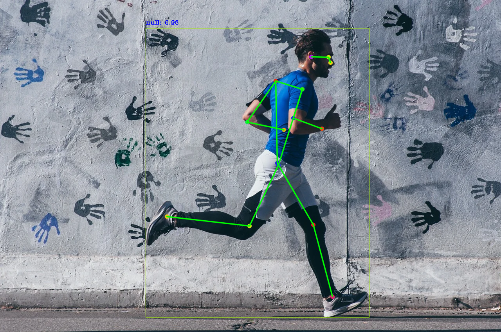

将yolov8模型导出为ONNX，并使用java进行预处理，推理

实现了yoloV11的pose任务的推理
将模型转换为onnx模型
```python
from ultralytics import YOLO

# Load a model
model = YOLO("yolo11n-pose.pt")  # load an official model
model = YOLO("path/to/best.pt")  # load a custom trained model

# Export the model
model.export(format="onnx")
```
原图

推理后
